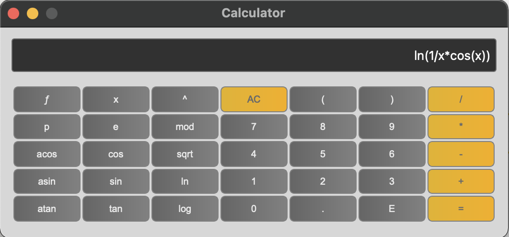
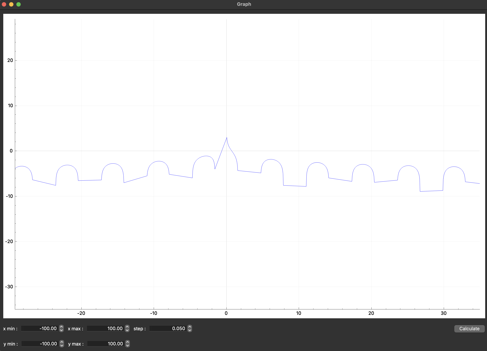
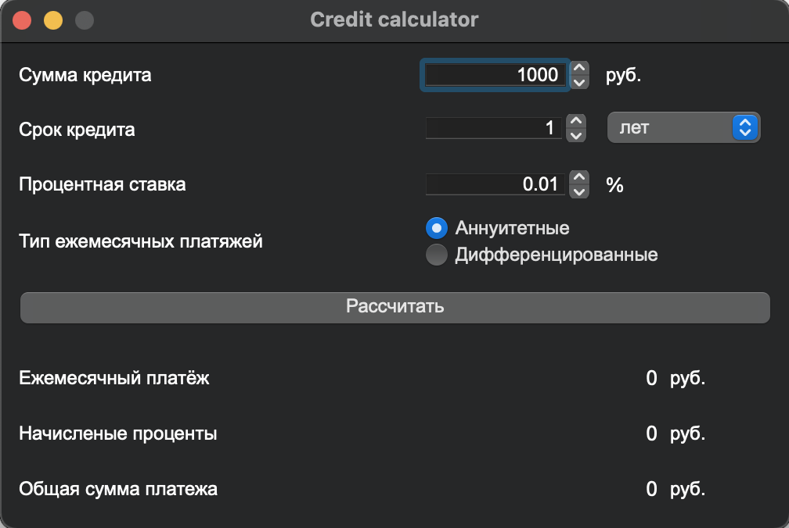
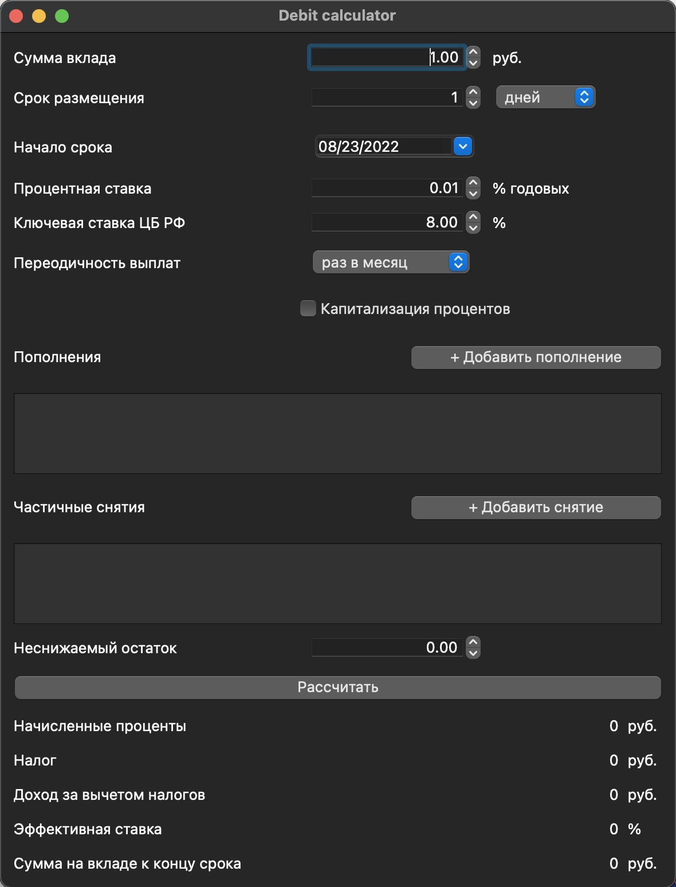

# Line calculator with graph output

## General Information
Calculator v1.0 is a command-line based and GUI scientific calculator developed in C++17. It allows users to perform arithmetic calculations, plot graphs of functions, and calculate the values of variables. The program is built using the Model-View-Controller (MVC) pattern, and its classes are implemented within the `SmartCalc` namespace. The calculator can handle both integers and real numbers with a dot, and allows input of numbers in exponential notation.

## Build
The program can be built using the Makefile provided. The following targets are available:
- `all`: builds the program and runs the `install` target.
- `build`: installs the program.
- `rebuild`: removes any existing installation of the program, builds it, and installs it.
- `install`: installs the program.
- `unistall`: removes the program from the system.
- `clean`: removes any existing installation of the program and cleans up any build artifacts.
- `cppcheck`: runs the `cppcheck` tool to check for errors in the code.
- `clang-format`: runs the `clang-format` tool to format the code.
- `tests`: builds and runs the unit tests for the program.

To build the program, run the following command:
```
make all
```

## Usage
After building the program, run it using the following command:
```
./Calculator
```
This will launch the GUI-based calculator. The program will accept input of arithmetic expressions and plot graphs of functions.


<div align="center">
  
  
  
  
</div>


## Dependencies
The program depends on the following libraries:
- GTest
- Qt 6

## Development
The code for this project is located in the `sourse` folder. Classes are implemented within the `SmartCalc` namespace. The project follows the Google style guide for C++ code.

## Examples of Usage
- To perform arithmetic calculations, simply enter an arithmetic expression into the calculator and press `=`. The result will be displayed in the output area.
- To plot a graph of a function, enter an expression in infix notation with the variable `x`. Then click on the `Plot Graph` button. The graph will be displayed in the output area.
- To calculate the value of a variable, enter an expression in infix notation with the variable `x`, and then click on the `Calculate` button. The result will be displayed in the output area.

## License
This project is licensed under the MIT License. See the [LICENSE](LICENSE) file for more information.